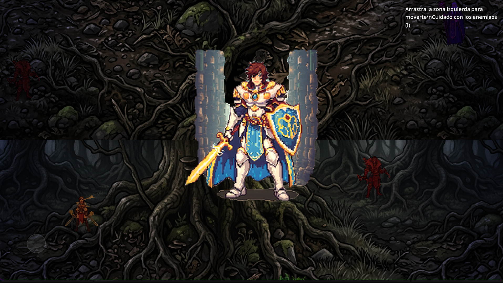
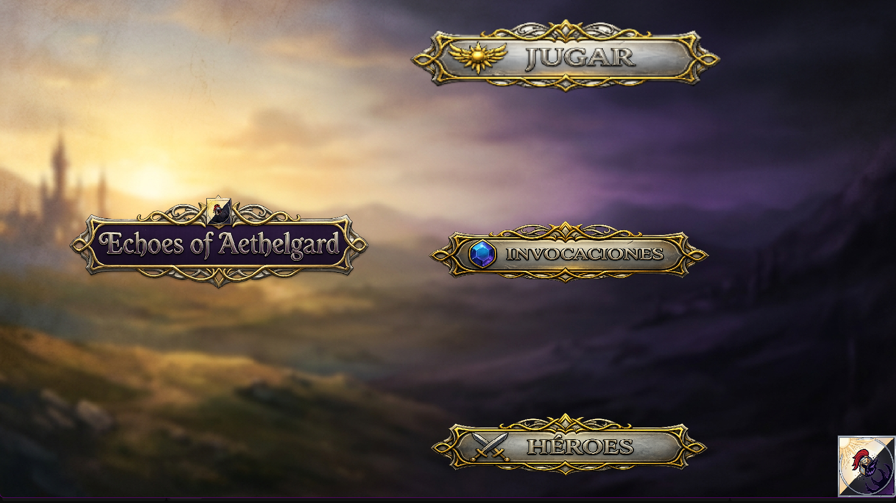

# Echoes of Aethelgard

> *Un RPG de fantasía medieval donde invocas héroes del pasado para restaurar un mundo consumido por el olvido.*

**Echoes of Aethelgard** es un videojuego en desarrollo creado con Godot, enfocado en combate, progresión de héroes y un sistema de invocación tipo gacha dentro de un mundo oscuro y fragmentado.

---

## 📑 Tabla de Contenidos

- [Historia](#-historia)
- [Gameplay](#-gameplay)
- [Sistema Gacha](#-sistema-gacha--la-grieta-del-destino)
- [Facciones](#️-facciones)
- [Mundo](#-mundo)
- [Capturas](#-capturas)
- [Instalacion](#️-instalación)
- [Tecnologías](#️-tecnologías)
- [Estado del Proyecto](#-estado-del-proyecto)
- [Objetivos](#-objetivos-a-futuro)
- [Autor](#-autor)

---

## 📜 Historia

Hace milenios, el reino de **Aethelgard** cayó ante una niebla corrupta conocida como *El Olvido*.  
Los grandes héroes no murieron… sus almas fueron fragmentadas y dispersadas a través del tiempo.

Tú eres el **Portador del Nexo**, el último capaz de canalizar las **Piedras de Memoria** para invocar a estos guerreros olvidados.

Tu propósito será:
- 🛡️ Purificar tierras corrompidas  
- 🧩 Recuperar fragmentos de héroes  
- 🏛️ Reconstruir el Salón de los Héroes  

---

## 🎮 Gameplay

El juego combina elementos de acción RPG con progresión estratégica:

- ⚔️ Combate contra enemigos corrompidos  
- 🎲 Sistema de invocación (gacha) mediante la **Grieta del Destino**  
- 📈 Progresión de personajes (estadísticas, rareza y roles)  
- 🌍 Exploración de biomas con enemigos únicos  

---

## 💎 Sistema Gacha — "La Grieta del Destino"

Los héroes son invocados utilizando fragmentos de ámbar en una grieta temporal:

| Rareza | Color | Descripción |
|--------|------|------------|
| Común | Gris | Soldados básicos |
| Raro | Azul | Veteranos de guerra |
| Épico | Morado | Comandantes históricos |
| Legendario | Dorado | Reyes y entidades míticas |

---

## 🛡️ Facciones

Cada héroe pertenece a una facción con identidad visual y rol específico:

### ☀️ La Orden del Alba
- Armaduras doradas, estética sagrada  
- Rol: Tanques / Paladines  

### 🌿 Cazadores del Bosque
- Estilo natural y sigiloso  
- Rol: Agilidad / Críticos  

### 🔮 Cónclave Arcano
- Magos, runas y energía mágica  
- Rol: Daño en área (AoE)  

### 🔥 Los Renegados
- Estética oscura y brutal  
- Rol: Daño explosivo / Berserkers  

---

## 🌍 Mundo

El progreso se divide en regiones con identidad y desafíos únicos:

- 🌲 **Bosque Susurrante** — Zona inicial y tutorial  
- ⚙️ **Ruinas de Hierro** — Enemigos armados y estructuras antiguas  
- 💎 **Ciudad de Cristal** — Núcleo de la corrupción  

---
## 📸 Capturas

---

## ⚙️ Instalación

1. Clona el repositorio
2. Ábrelo en Godot 4.6.1
3. Ejecuta el proyecto

---

## 🛠️ Tecnologías

- Motor: :contentReference[oaicite:0]{index=0} (v4.6.1)  
- Lenguaje: GDScript  

---

## 🚧 Estado del Proyecto

🔧 Actualmente en desarrollo (prototipo funcional)

Incluye:
- Sistemas base implementados  
- Interfaz inicial  
- Primeros elementos de combate  

---

## 🎯 Objetivos a Futuro

- 🔊 Implementación de sonido y efectos  
- 🎨 Mejora visual de la interfaz (UI medieval)  
- ⚔️ Profundización del sistema de combate  
- 🤖 Inteligencia artificial de enemigos  
- 📦 Sistema completo de progresión y héroes  

---

## 👤 Autor

Desarrollado por **Juandedios**

---

## 📌 Notas

Este proyecto se encuentra en evolución constante, enfocado en el aprendizaje y en la construcción de un videojuego completo con estándares profesionales.